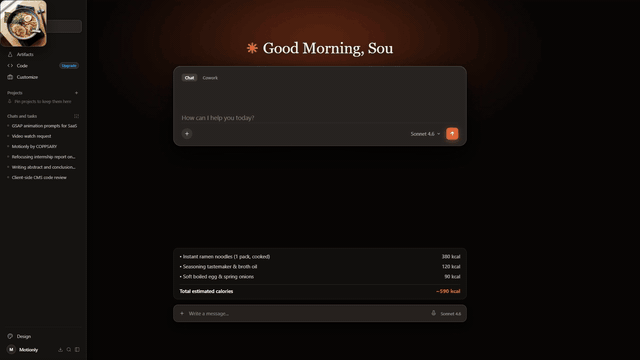

<div align="center">
  <h1>
    
    <span valign="middle">Motify</span>
  </h1>

  <p>
    AI tool that makes SaaS explainers and launch videos.
  </p>

<p align="center">
  
  <a href="https://www.kiritts.com/">
    
    <font size="5" valign="middle"><b>KiriTTS</b></font>
  </a>
</p>
</div>

<p align="center">
  <a href="#showcase">Showcase</a> &middot;
  <a href="#features">Features</a> &middot;
  <a href="#quick-start">Quick Start</a> &middot;
  <a href="#development">Development</a> &middot;
  <a href="docs/introduction.md">Docs</a>
</p>

---

## Showcase

<table>
  <tr>
    <td width="50%" align="center">
      
    </td>
    <td width="50%" align="center">
      
    </td>
  </tr>
  <tr>
    <td width="50%" align="center">
      
    </td>
    <td width="50%" align="center">
      
    </td>
  </tr>
  <tr>
    <td width="50%" align="center">
      
    </td>
    <td width="50%" align="center">
      
    </td>
  </tr>
</table>

---

## Features

Motify combines normal HTML/CSS/JavaScript authoring with a visual editor, direct DOM/SVG rendering, and professional GSAP timelines.

- Build compositions from semantic HTML and inline SVG
- Choreograph scenes with GSAP timelines, overlap, stagger, masks, text reveals, and camera movement
- Preview, play, pause, restart, and deterministically scrub the same timeline used for export
- Select elements and adjust position, scale, rotation, opacity, and text in the visual editor
- Navigate scenes from the storyboard and inspect their timing on the editor timeline
- Reuse a focused library of composable animation presets without introducing a custom animation language
- Render images and SVG assets directly in the composition DOM
- Export PNG frames or a full H.264 MP4 from the exact composition shown in the preview

HTML compositions are the project source. Motify does not convert projects into a second format: preview and export mount the same HTML and seek the same GSAP timeline.

## Quick Start

Requires Node.js `20.19.0` or newer.

```bash
npx @coppsary/motify@latest init my-video
cd my-video
npx @coppsary/motify@latest dev
```

The initializer creates a code-first Motify v2 project and installs the bundled `write-motionly` and `scene-design` skills for your coding agent. Those skill and runtime identifiers remain unchanged so existing compositions stay compatible. Use `--provider codex`, `--provider claude`, or `--all`; use `--skip-skills` when you do not want agent setup.

To add or refresh the skills in an existing project:

```bash
npx @coppsary/motify@latest skills add --provider codex
npx @coppsary/motify@latest skills update --provider codex
```

Local projects keep visuals in `composition.html`, optional CSS in `styles.css`, motion in `timeline.js`, metadata/mounting in `index.ts`, and media in `assets/`. The CLI editor reads and saves those files directly. Use your coding agent to change the project source; the Local editor provides the preview, timeline, inspector, presets, assets, source view, and export without an in-editor AI chat.

The browser deployment runs in Cloud mode. It uses the same editor with Tiffy chat, AI generation and editing, and cloud project management.

See the [introduction](docs/introduction.md), [architecture guide](docs/architecture.md), [editor guide](docs/editor.md), and [animation presets](docs/animation-presets.md) for the current workflow.

## Development

```bash
git clone https://github.com/COPPSARY/Motify.git
cd Motify
npm install
npm run dev
```

Before opening a pull request:

```bash
npm run type-check
npm run test:run
npm run build
npm run qa:editor
```

See [Contributing](CONTRIBUTING.md), the [Roadmap](ROADMAP.md), and the [documentation](docs/introduction.md) for project details.

## Third-Party & Credits

Motify incorporates open-source motion components, blocks, and motion primitives from **[HyperFrames](https://hyperframes.heygen.com)** by HeyGen, Inc. and its community contributors under the Apache License 2.0. See [THIRD_PARTY_LICENSES.md](THIRD_PARTY_LICENSES.md) for full attribution, licensing details, and component manifests.

## License

Licensed under the [Apache License 2.0](LICENSE).

---

<div align="left">
  <p>
    <a href="https://github.com/COPPSARY">GitHub</a> &middot;
    <a href="https://web.facebook.com/profile.php?id=61567582710788">Facebook</a>
  </p>
</div>
