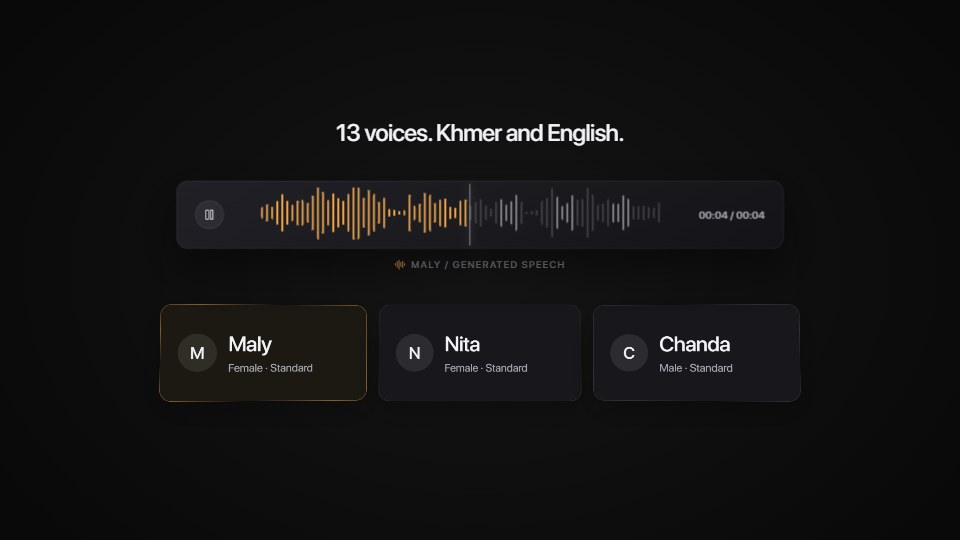
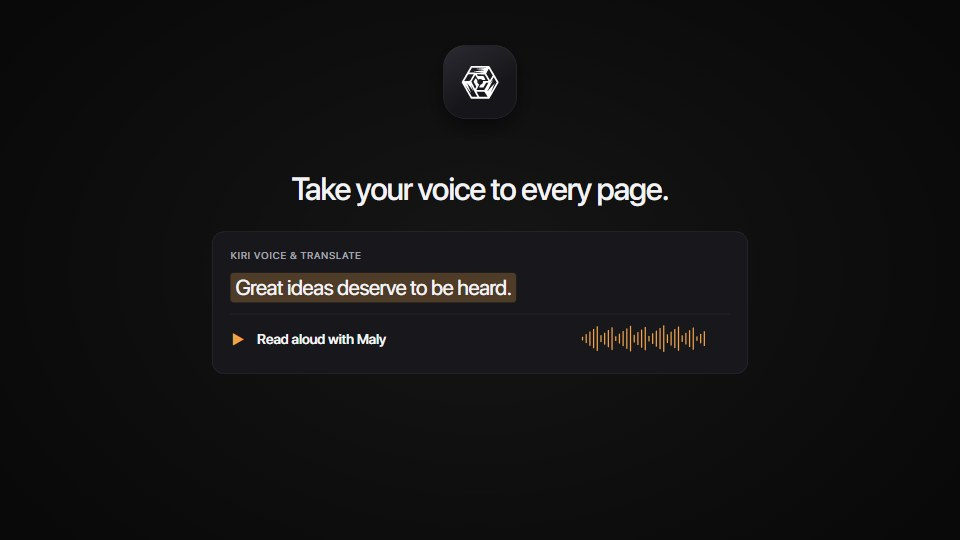
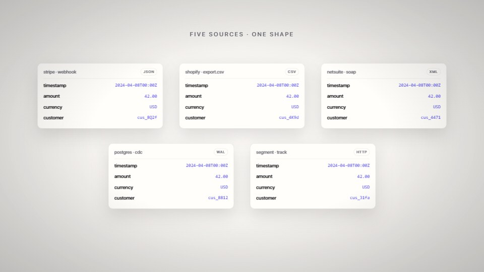
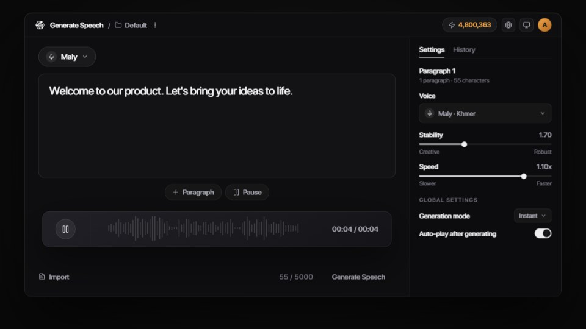
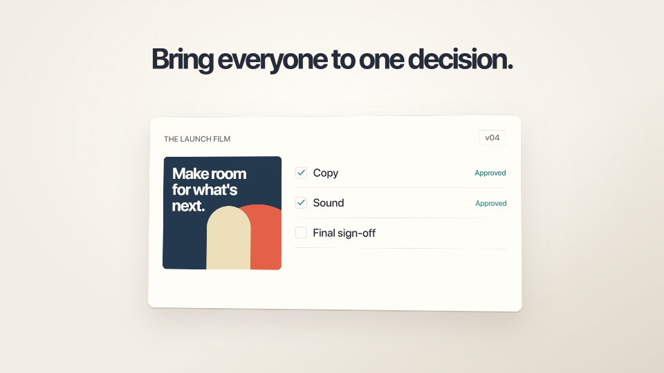
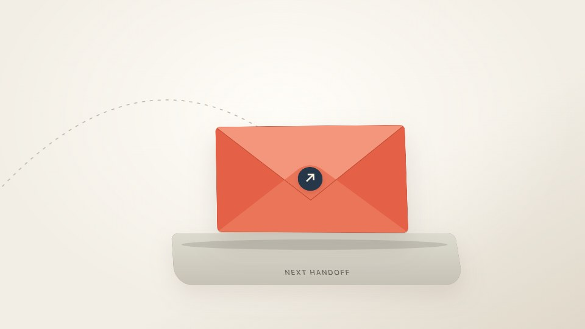

# Preset continuity review

KiriTTS keeps its logo at the intended geometry after reuse, clears the editor before introducing voice profiles, and demonstrates API and browser capabilities in separate reading windows. The full voice library remains in the picker.

Tessera resolves fields on one record at a time and places the final five-record comparison inside the frame.

Captured from the shared composition runtime with `node qa/preset-film-qa.mjs`. The check compares projected geometry and text across forward and reverse seeks, checks logo bounds, and checks that final result cards are contained and non-overlapping. The reviewed presets are silent. These are visual regression examples, not evidence that new live AI generations have been evaluated.

## Output spacing and a third direction

KiriTTS gives generated audio a separate row below Paragraph/Pause and above the footer. Shallow card perspective returns on reading shots without rotating the outgoing editor through the next subject.

Relay is a fictional review-and-handoff concept with warm paper and coral, a single persistent brief, visible approvals, a folding packet and a lateral camera journey. It supplies a different causal pattern in the bundled AI skill.

